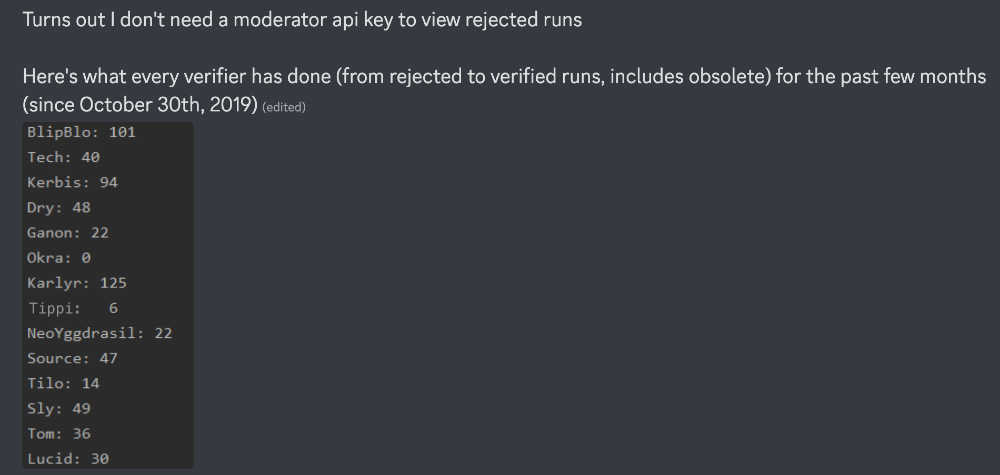
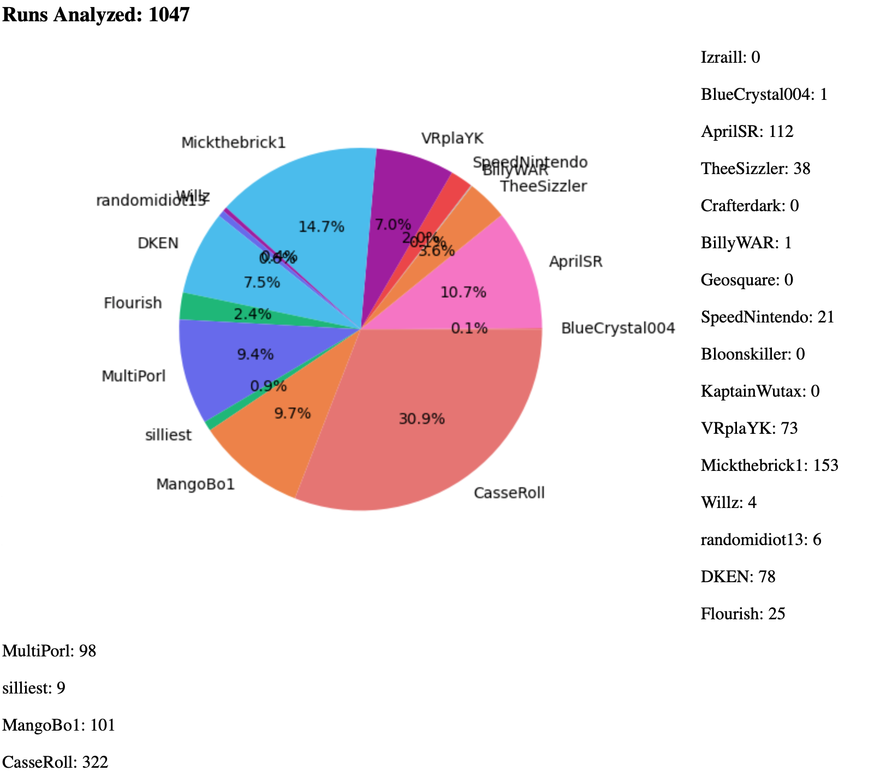

# SRC Analyzer Rewrite

**This was originally written February 16, 2023.**

At the start of 2023, I decided to rewrite the entirety of my Speedrun.com
analysis program. The goal of this program was to allow for easy visualization
of verification statistics on the many games available on speedrun.com, a
speedrun site. The “verifiers” would generally be tasked with making sure runs
were legitimate. This process was not exactly the easiest, although varied from
game to game. However, little information or tools existed directly within
speedrun.com to easily keep track of verifier activity. Many communities would
end up relying on individuals mentioning when they are verifying to keep track,
which was unreliable. This, along with learning that speedrun.com had a freely
available public API, motivated me to make a program to help visualize this
data.

The first program was incredibly rudimentary. It was a single Python script
running on a local machine that would query speedrun.com’s API for a list of
runs verified, then sort them by the user. This script was so simple that it was
not even dynamic. That is, any time a game wanted to be queried, one would have
to fetch all the IDs for users manually so that the run request could be made.

This manual nature, while useful information to have, was difficult to keep up.
Any time someone wanted specific data, they would have to come to me and I would
have to manually hack together the script to make it function properly, which
could take hours. After I got several requests from moderators from games I had
no contact with, I decided the best thing to do is throw it onto a web server.
So, I looked into how to make basic HTML (as well as how to use Flask (Django
looked too complicated)), and I was off.

This version was… not good. It used a lot of terrible libraries that could not
work together at all, and it required a lot of hacking together on even the
client side to get working. However… it would work. Eventually, this tool became
the `srdc-verification-analyzer` program. While it was not “popular”, it got
more attention than I ever expected it to. It remains one of my more popular
projects, and consistently makes up the bulk of requests to any of my web
servers. Around the time speedrun.com had infamous issues loading large queues,
and I noticed that the API seemed to load this information easier, so I decided
to add that functionality as well, which still gets used even to this day.

The problem with the program at this point is that it was a hack on top of a
hack, and a lot of the code had issues. Not only was bulk completing massive API
requests entirely on a server that refused to respond until those were done a
terrible idea, it also had issues such as a terrible method of parsing dates
that featured code that was just stitched together from what “worked for me”. As
such, especially when more of these inconsistencies became noticeable, as well
as my general programming skills getting significantly better than when I
started it, I decided to rewrite it. And here we are.

What happens next? Well, the old program will be discontinued and removed from
all my servers. When will I do this? Idk. As for the new version, it should be
significantly easier to keep up and will stay around as long as I feel like
maintaining it. And hell, if it works, it works. It was one of my first big
projects using React and a CSS component library (in this case, Material UI). I
think it worked fairly well, although a large part of the program ended up being
getting the frontend to look nice, rather than getting the API requests and
filters working. Shoutouts to `src-ts` btw for doing a lot of my work for me
when it came to interacting with the speedrun.com API.

While as of writing, issues still exist. However, I will probably release the
program with them in, as they are not major enough to warrant waiting for me to
get around to fixing it. Either way, there it is. While not the biggest project,
or a project that needed a writeup like this, it still is an interesting story
for me to look back on.
