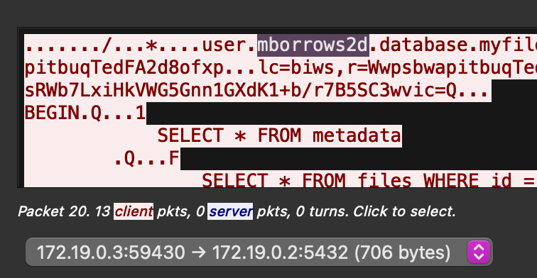

# National Cyber League Spring 2025: Team Game

This is a compilation of writeups for challenge I completed during the National
Cyber League Spring 2025 Team Game. I competed with other members of my
university. This list may grow in the future, but many of the challenges I had a
meaningful impact on were either fairly uninteresting to me or challenges that
require CyberSkyline infrastructure. Either way, I hope this is helpful!

## Password Cracking - Hard

File: [hashes.txt](../static/ctfs/ncl-spring-2025-team/hashes.txt)

This is a great intermediate showcase of Hashcat.

The format of the required passwords is `[adjective]-[noun]-[MAC]`.

This document is written after the challenges closed, but the sample wordlist
they give you will crack some of the initial ones, but for the sake of this
overview we won't use it.

In [this repository](https://github.com/taikuukaits/SimpleWordlists), there is a
large noun and adjective list. This list will be able to crack every password,
but we don't know the last four MAC yet, and running this list with every MAC
will take longer than the timespan of the game.

So, we download the common list and attempt to crack some of the hashes with
that. If we get at least one, the MAC we set will be identified, which saves
massively on the randomization part of this attack.

`hashcat -a 1 Wordlist-Adjectives-Common-Audited-Len-3-6.txt Wordlist-Nouns-Common-Audited-Len-3-6.txt -j '$-' -k '$-' --stdout > adjectives-nouns-common.txt`
This command will generate the combined adjective-noun wordlist. Because hashcat
lacks customizability, this list has to be generated before running a proper
attack against the list, as we're combining it with a mask attack. the `-j` and
`-k` flags add dashes after the adjective and noun list respectively, allowing
the format of `[adjective]-[noun]-[MAC]` to work.

From here, we have to run the "hybrid" attack. We don't know if the MAC is
represented with lowercase or uppercase, but the mask feature supports both:
`?h` for lowercase hex and `?H` for uppercase hex. This attack doesn't take long
to run, but we can skip to the fact that its uppercase.

Funnily, due to the hexadecimal brute force, this will be the longest attack to
solve it.

`hashcat -m 0 hashes.txt -a 6 adjectives-nouns-common.txt "?H?H?H?H"` - This
uses the list generated before and cracks the file with the hashes, which are
just standard md5 (`-m 0`). `-a 6` is a hybrid attack, specifying to put the
wordlist we just made and adding a brute force of four hexadecimal numbers. The
wordlist has a dash after the noun in it, thus allowing the mask to work just
with special characters.

```
aac3d5f9f582d59bda26655f124478b6:small-chair-CFCE
50177306bd927c40da5e059ca444c8fc:tiny-box-CFCE
```

These hashes both have the same MAC: `CFCE`, thus allowing us to bring out the
full wordlist. It's important to note that the adjectives and nouns main list
has it in uppercase, when the challenge specifies lowercase. **Change this
before creating the massive wordlist. I promise.**
`cat <adjective/noun wordlist> | awk '{print tolower($0)}' > <adjective/noun lowercase wordlist>`.

`hashcat -a 1 Wordlist-Adjectives-All-lower.txt Wordlist-Nouns-All-lower.txt -j '$-' -k '$-' --stdout > adjectives-nouns.txt`
\- **This will generate about a 53gb file, so be prepared for that.** This is the
main combination list with all adjectives and nouns in the wordlist. It works
the same way as the previous command, just generating a much, *much* bigger
list.

Now, with this massive wordlist in hand, it's time to run the main event. While
I did this differently when completing it myself--using `sed` to add the known
MAC to the wordlist then doing standard dictionary--there is a much faster way
to crack this using hashcat that runs on the GPU rather than CPU. Both work, but
this is the optimal way.

`hashcat -m 0 hashes.txt -a 1 adjectives-nouns.txt CFCE.txt` - This command
decides to combine the massive file generated with the file `CFCE.txt`, which
contains the literal text `CFCE`, aka the known MAC. This is technically a
combinator attack, but abusing the fact that we can just use hashcat to append
the known MAC rather than another tool.

This command will take forever to run. A Mac Mini M4 took around 2-3 minutes,
but that's a pretty good system to run this kind of thing on. Enjoy the wait,
but it will work!

Final pot (`hashcat -m 0 hashes.txt --show`):

```
9d5f59af7fb0e709cc312c225d6a86bb:big-apple-CFCE
50177306bd927c40da5e059ca444c8fc:tiny-box-CFCE
aac3d5f9f582d59bda26655f124478b6:small-chair-CFCE
d28cd42a792cf7ebf1255bb8725eecb9:vivid-painting-CFCE
db6c56a98392d81503c52b4b0e43d5a6:ubiquitous-surveillance-CFCE
```

## Network Traffic Analysis

### HTTP Forever

File:
[httpFOREVER.pcapng](../static/ctfs/ncl-spring-2025-team/httpFOREVER.pcapng)

This is a great introduction to `thark`, as it helps automate large parts of the
process. Rather than having to read the file in Wireshark (though it is useful
to get the field names), there isn't much to solve the commands. Rather than
figures, the commands entered will be shown per question:

- Q1 (How many responses didn't return HTTP 200?):
  `tshark -r http.pcap -Tfields -e http.response.code -Y "http.response" | grep -v "200"`
- Q2 (What webserver was x IP using?):
  `tshark -r http.pcap -Tfields -e http.server -Y "ip.src == 146.190.62.39"`
- Q3 (What hostname did x filepath come from?):
  `tshark -r http.pcap -Tfields -e http.host -Y 'http.request.uri == "/icons/favicon-red.ico"'`
- Q4 (Which client was using Chrome?):
  `tshark -r http.pcap -Tfields -e ip.dst -Y 'http.user_agent ~ ".*Chrome.*"'`
- Q5 (How many unique IPs did x IP talk to?):
  `tshark -r Downloads/httpFOREVER.pcapng -Tfields -e ip.dst -Y "ip.src == 192.168.232.132" | uniq`

### SQL Storage Secrets

File: [traffic.pcap](../static/ctfs/ncl-spring-2025-team/traffic.pcap)

Packet file is obviously a packet capture of a Postgres database. Makes it
really easy to read all the information. Due to being a consistent TCP stream,
it makes it really easy to follow the entire connection. Instantly, I choose to
follow the main Postgres stream and view the information transmitted in that
view. This answers a couple questions, notably the IP address for the server
(Postgres operates on 5432, a connection happens over 5432), and the username is
revealed in the first connection request, identifying the user and database
being connected to.



Viewing the sent server information also reveals the queried metadata table,
showing the date the metadata information for the "invoice" was created.


The files here are big. The output is contained in the database under the column
`file_content`, and this is difficult to retrieve generally. I chose to retrieve
most of the files in an easier way by looking up for TCP packets that needed to
be split and reassembled by filtering for `tcp.reassembled.data`. Getting that
information and copying the value, then putting it into CyberChef, makes it
easier to filter out what is properly the filename.


All the files were exported, finding a couple images that don't matter, the
"invoice" PDF that now answers that it is, in fact, a PDF with a total of
$701.93. The flag is a bit harder. Part of the information extracted was a
password-protected ZIP file. The password was not found in the re-assembled
pieces. However—after counting the files in the metadata—one was missing.
Cross-referencing the metadata IDs showed the file "DO NOT OPEN" was not in the
reassembled packets, likely because the information was too small. Searching for
the metadata ID found the file had been queried. After extracting its
information, the password revealed itself, thus allowing access into the ZIP
file, and showing the flag!


### Ping of Domin8tion

File: [nta_1.pcap](../static/ctfs/ncl-spring-2025-team/nta_1.pcap)

The description of the challenge is referencing a ping of death, and the
challenge description itself describes someone attempting to do data
exfiltration. Instantly opening the file showed a series of ping requests,
though notably no response, making it easier to filter for. ICMP packets have a
"data" field—normally randomized data sent back to ensure the entire ICMP packet
matched—has miscellaneous information. As such, I chose to use `tshark` to
extract all the data information, assuming it's all related.


`tshark -r file.pcap -Tfields -e data.data`


This information, while can be hex decoded correctly and appears to be
information, just appears to be complete gibberish. Looking closer at Wireshark,
the packets appear to be out of order in the file, an unnatural thing to see
within Wireshark capture files (because this was generated with a script). As
such, I made the assumption that the information must be put in the correct
order before being used.

`tshark -r file.pcap -Tfields -e frame.time_epoch -e data.data | sort | awk '{print $2}'`


From here, the information is copied into CyberChef. Instantly, the PNG header
became visible, but it suspiciously wasn't at the start of the file where it
belongs. Through looking at more of the file, it's clear that every line has a
separator to indicate the order of the packet. Looking at the information (it
wasn't confirmed but solving the challenge proved it), the packet order is the
correct order, so the headers simply need to be removed.


`tshark -r file.pcap -Tfields -e frame.time_epoch -e data.data | sort | awk '{print substr($2,11) }'`


The flag was then revealed converting all of it out of hexadecimal, showing the
image with the flag!


