# National Cyber League Spring 2026: Individual Game

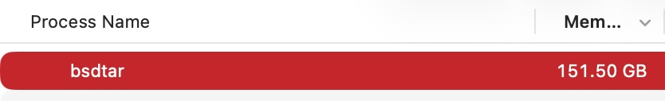

## Password Cracking

### Unlocking

File: [usb-clone.img](../static/ctfs/ncl-spring-2026-solo/usb-clone.img)

1. 15 points - What is the file signature in the header of the usb-clone image
   in ASCII?

1. 25 points - What encryption format does usb-clone have?

1. 25 points - What is the password for the usb-clone?

1. 25 points - What is the flag in usb-clone?

This one I chose to highlight from the password cracking section because it's
the one that's the most interesting, and took way too long to figure out. The
file is a BitLocker encrypted FAT32 image. Something you don't exactly see every
day. Firstly, as it's password cracking, it can be reasonably assumed that the
BitLocker password has to be recovered. Thankfully, `bitlocker2john` has been
around with the `john` suite for ages, and worked for this image.

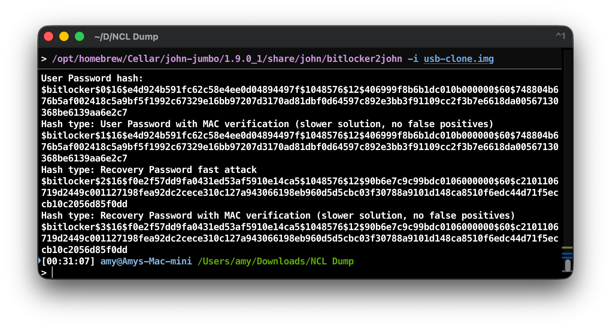

From here, we had to actually crack it. BitLocker is a bulky encryption
algorithm, so cracking it takes a lot of time, but eventually the password
`johncena1` found in the `rockyou` wordlist worked, giving the password for the
image.

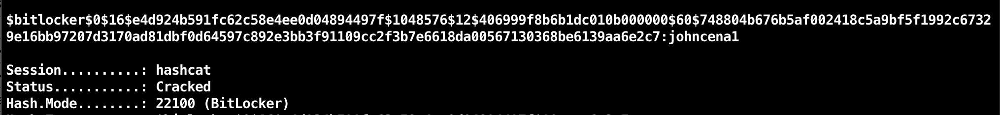

Now, to actually read it. This took a lot of work, and I even fired up a Windows
VM to try and see if it would respond to the file better. Most systems expect
*NTFS* BitLocker, including seemingly Windows? Either way, I could never get it
working. Ironically enough, `dislocker`, the Linux command-line utility, was the
one that ended up working. It was only available on Linux and not macOS, so a
Kali VM was used and the file was uploaded, mounted, then the flag could be
shown.

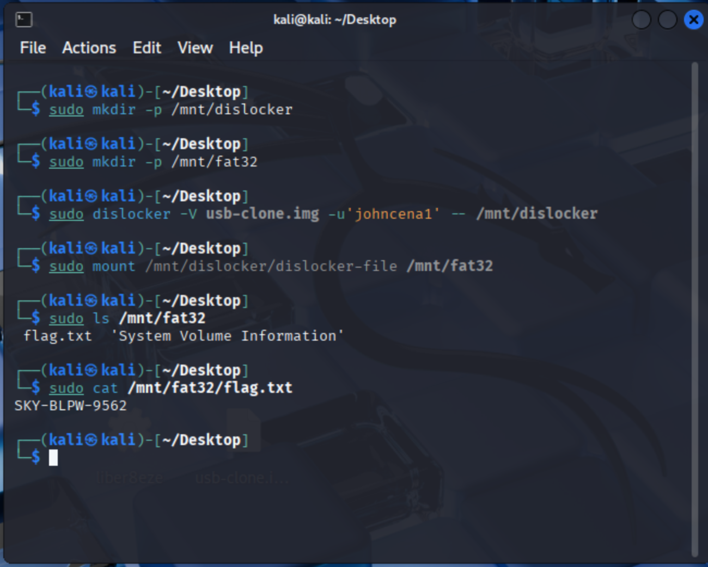

## Networking

### Parsing DNS

File: [dnsqr.dump](../static/ctfs/ncl-spring-2026-solo/dnsqr.dump)

1. 10 points - What DNS object is being queried (answer in lowercase)?

1. 10 points - How many DNS records came back from the DNS server in the reply
   packet?

1. 10 points - In this DNS reply, what is the canonical name of this DNS object?

1. 10 points - What is the local DNS resolver's IP address?

1. 10 points - To allow this DNS query to be placed, what protocol would need to
   be allowed outbound by a firewall?

1. 10 points - To allow this DNS query to be placed, what destination port
   (number from 0-65535) would need to be allowed outbound by a firewall?

1. 10 points - What company owns the block of Ethernet addresses used by the
   local DNS resolver?

1. 20 points - What's the product (in decimal) of multiplying the IP IDs of the
   two packets together?

1. 10 points - What is the IP TTL (in decimal) of the DNS response packet?

This challenge was, by my account, meant to be solved by hand. That was boring
though. The hexdump started with `c3d4 a1b2` which sort of resembled the
`libpcap` header format, but not entirely. The transformation took me a bit to
understand, but the file was byte-swapped every 16 words. There were some endian
oddities, so the file had to be byte-swapped to be readable. I chose to tackle
this by converting the hexdump into just raw data, then using `dd` to cleanly
swap the bytes in a standardized way:
`dd if=download.dat conv=swab of=capture_dl.pcap`. This swapped it into a fully
readable capture file, thus allowing Wireshark to be used to solve all the
questions.

### Compressed Analysis

Files: [capture.pcap](../static/ctfs/ncl-spring-2026-solo/capture.pcap),
[tls_keys.log](../static/ctfs/ncl-spring-2026-solo/tls_keys.log)

1. 5 points - What is the IP address of the host receiving POST messages from
   the attackers?

1. 5 points - What layer 2 protocol was abused allowing the hackers to intercept
   traffic?

1. 5 points - What is the IP address of the compromised host?

1. 5 points - What IP address did the compromised host impersonate? Enter as
   comma separated IP addresses, etc: 192.168.0.1,192.168.0.2

1. 10 points - What version of NGINX is used as noted in the response headers?

1. 10 points - What is the value of the flag extracted by the attackers?

1. 20 points - By how many bits does the length of a packet differ from a
   successful guess vs an unsuccessful guess?

1. 10 points - What data compression algorithm is used by NGINX to compress HTTP
   response content?

1. 30 points - What is the name of the attack carried out to extract the flag in
   this packet capture. Answer with the acronym, not the full name.

This one was a fun, though slightly tricky. The attack demonstrated in the file
took a while to figure out, but was eventually worked out to be a BREACH attack.
This attack comes with the recommendation to not compress sensitive traffic
that's already encrypted. Here's how it worked. There are three devices: 0.3,
0.4, 0.5. 0.3 is the initial client, who is sending arbitrary data to 0.4, which
is the relay system. 0.4's job is to relay that message to 0.5, which replies to
0.4 with an answer. 0.4 does not send it back to 0.3. The attacker arp spoofed
0.5, so that any traffic destined from 0.4 to 0.5 and back would also be
delivered to the attacker. However, the packets delivered to the attacker are
TLS encrypted. In these packets (that can be decrypted with the TLS log), the
contents show that 0.3 is sending to 0.4 a guess at the flag. 0.4 sends that to
0.5, and 0.5 replies with "that flag is wrong, this is the correct one". As the
conversation between 0.4 and 0.5 is encrypted, the attacker can't see the flag.
However, the attacker can brute force the flag by spamming the endpoint with a
brute forced character. If the character is correct, due to issue with `gzip`,
there will be a one byte difference if their last character was correct. Thus,
allowing the attacker to slowly brute force the key.

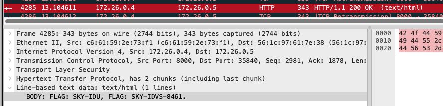
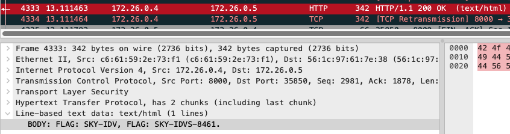

From this, the attacker was able to correctly build the whole flag. Most of the
questions surrounding this challenge focus on figuring out what that attack is,
who's sending messages to who, etc.

## Web Application Exploitation

### JS Vault

File: [vault-de.js](../static/ctfs/ncl-spring-2026-solo/vault-de.js)

1. 5 points - Are there any tools that can automatically reverse JavaScript
   obfuscations (Y/N)?

1. 10 points - What three characters prefix every function?

1. 15 points - What digits will never be part of the combination, regardless of
   the flag value? Enter digits separated with commas, ex: 1,2,3

1. 15 points - Which function returns the SKY- prefix for the flag?

1. 15 points - There is a function that reaches out to the server. What file
   does it retrieve?

1. 40 points - What is the flag for this challenge?

This one was much easier than it should've been. Client-side JS is usually
pretty easy to figure out and this was no exception. The original file was
obfuscated JavaScript, but there are plenty of websites that exist to help clean
it up. The cleanup wasn't perfect, and there were still some organizational
issues, but it still worked. The question for reaching out to the server was
super easy to work out, just search for `fetch`. Furthermore, the flag question
just involved tracing functions. Any web browser lets you execute loaded
functions independently, so tracing the remote file and identifying where it's
used is helpful. The function was `cs_X()`.

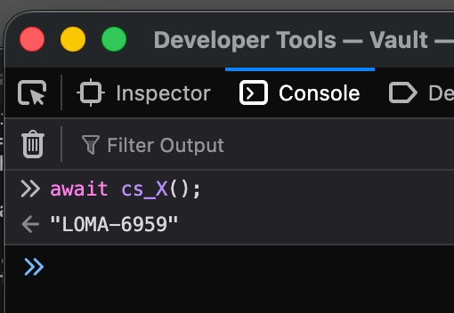

Other flags were fairly easy to identify. There's a `parseInt()` function that
parses the input in octal, thus limiting the numbers to octal numbers, `SKY-` is
set in `cs_V()`, etc. Overall, once the JavaScript is de-obfuscated, the
challenge is trivial.

## Enumeration & Exploitation

### Breads

File: [bread](../static/ctfs/ncl-spring-2026-solo/bread)

1. 10 points - What language is this program written in?

1. 20 points - How many variables are declared in the main function?

1. 25 points - What 3 header files are included in the program? Answer in the
   following format: `<header1>, <header2>, <header3>`. i.e.
   `<test1>, <test2>, <test3>` The order doesn't matter, and you do not need to
   include the angle brackets.

1. 20 points - How many unique responses to user input will the program output,
   not including the line that says "You chose: X"?

1. 25 points - What is the flag obtained when you enter the correct type of
   bread?

This one was very easy, much easier than most E&E medium challenges. For this
one, all that was needed was Ghidra. Pretty much all of these questions can be
solved by opening Ghidra and poking around, especially since Ghidra C++ analysis
is pretty solid and the code didn't require much cleaning up.

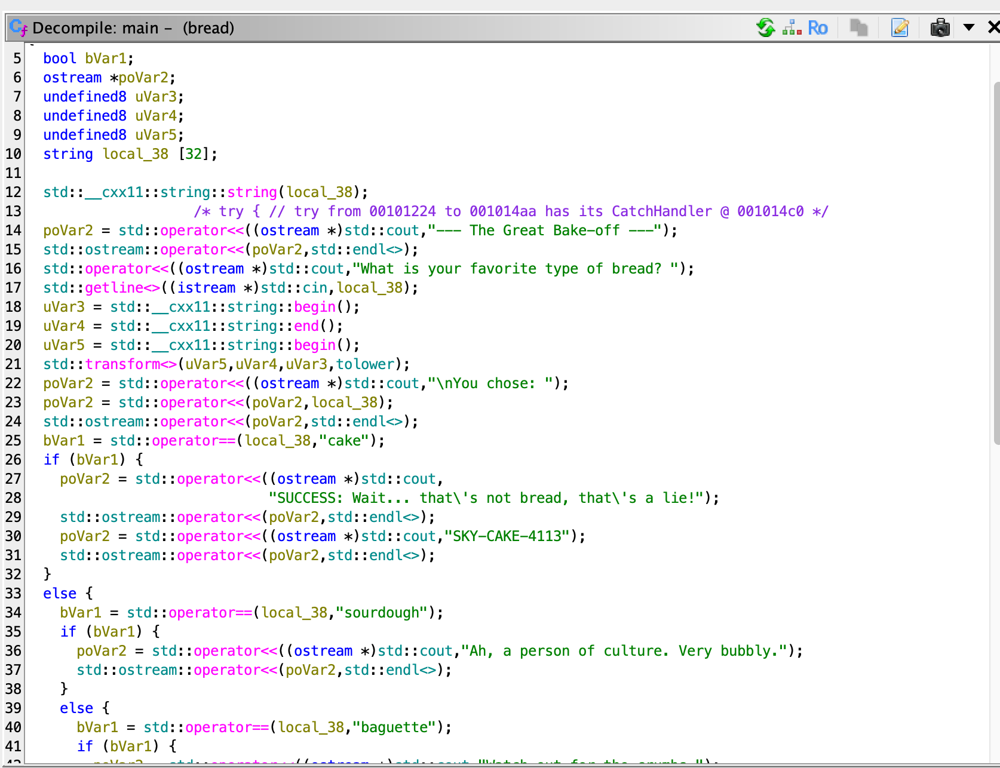

### Liber8eze

File: [liber8eze](../static/ctfs/ncl-spring-2026-solo/liber8eze)

1. 10 points - What language is this binary written in?

1. 15 points - What permission bit is set on the binary that runs it with
   elevated privileges?

1. 15 points - What environment variable can be used to control command
   execution?

1. 15 points - What shell is used to execute the injected command?

1. 20 points - What libc function is called to preserve privileges before
   executing the shell command?

1. 25 points - What is the flag?

Now, this one. Very quickly looking around in Ghidra it was obvious that this
was Rust. Despite the claims I had heard about Rust analysis becoming easier in
Ghidra, it still wasn't there. Finding the main function required a lot of
searching around in the program's memory, especially at miscellaneous data
strings. Based on the questions it was easy to assess the premise: This is a
Rust binary that has SUID permissions (thus granting it root access) that calls
into other system applications through its use. The environment variables
question also helped speed up the analysis, and very quickly my eye was on the
DATA strings that existed throughout the program.

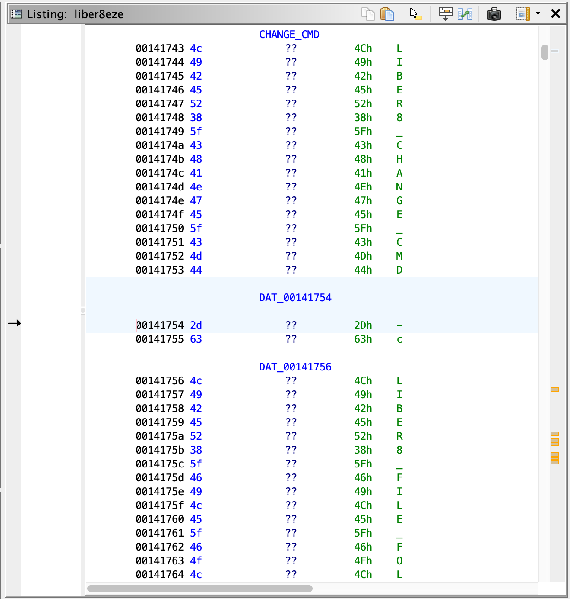

In here, and throughout their use in the program, the Rust code read from
environment variables that could override existing functions within the program.
This included things like which shell to use, for example. Throughout this
analysis and poking around, it became obvious that the program used `sh -c` to
run certain arbitrary commands, such as adding a new line. The program did
attempt to get around the permission issues this would cause by setting UID
permissions using `sh` to avoid inheriting any problems, but this could be
gotten around. Importantly, the program made the decision to use `which` to
determine the path to `sh`. Because it chose to use this, we could manipulate
the path to point to a custom `sh`.

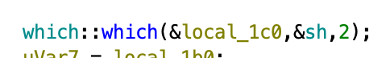

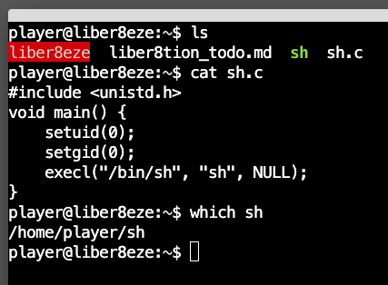

From here, while also setting `LIBER8_CHANGE_CMD` to anything other than its
default, we can force the evaluation of our own "sh" that gives us a root shell,
allowing us to cat the flag.

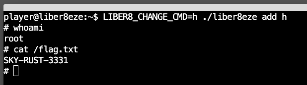
