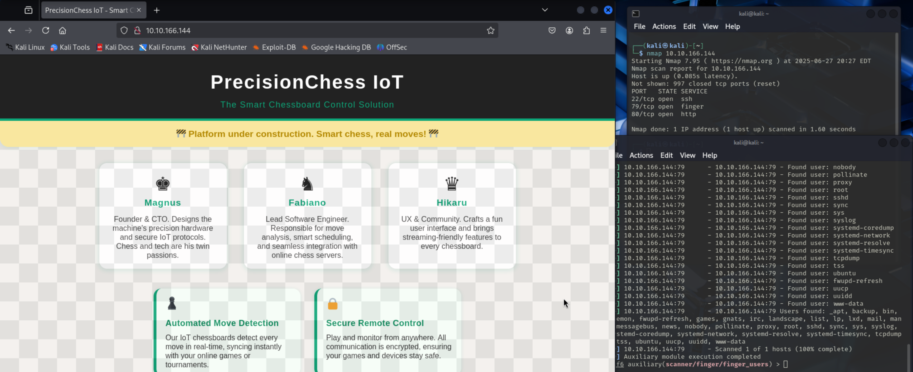
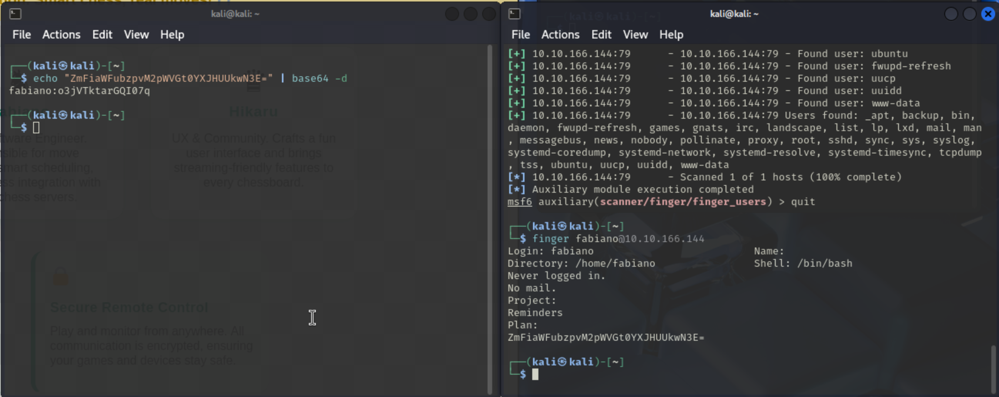
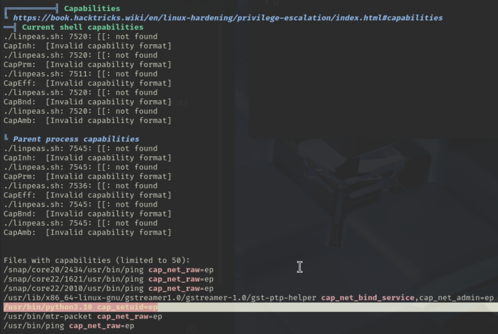
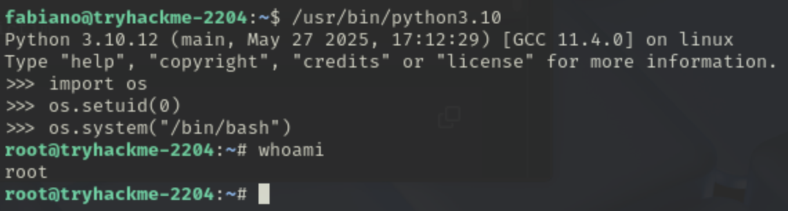

# TryHackMe Industrial Intrusion CTF

This was a simple weekend CTF that we did with a couple students at my
university. There wasn't that much we did, but here's one writeup about one of
the more interesting challenges we did.

## Chess Industry

This challenge was super fun and a fairly simple introduction to Linux hacking
and whatnot.

As always with any box, I instantly ran `nmap` and noticed that `finger` was
running on it! `finger` allows for the querying of users and user information
remotely, so I found a metasploit module and ran that to figure out what kinds
of users existed on the system. This, however, wouldn't reveal much, outside of
identifying this box as a really simple Ubuntu minimal installation. As such, I
went to the website open on port 80, and found a couple names referencing admins
on the site.

From here, after a little bit of poking around, I decided to run `finger` on
some of the names present on the website. Lo and behold, they have accounts! And
not only that, one of them used the `Plan` section that `finger` uses to include
a base64-encoded copy of their password! How convenient!

This allowed for a successful SSH connection onto the server, cracking the user
flag along with it.

From here, obtaining the root flag would be harder. I chose to get Linpeas on
the server by using `scp` with the account I logged in as (after checking
`sudo -l` wouldn't reveal anything) Upon running Linpeas, something was flagged
as having a 95% chance of allowing privesc: the Python binary had a "capability"
set.

I didn't know much about this form of permission, and upon further
investigation, it's a flag that the Linux kernel can grant applications,
allowing more control over standard SUID/GUID. In this case, the `python` binary
had permission to set its own running `uid` for account! This was fantastic
news, and would allow me to run Python, set the `uid` to 0, then start a shell.
🎉

